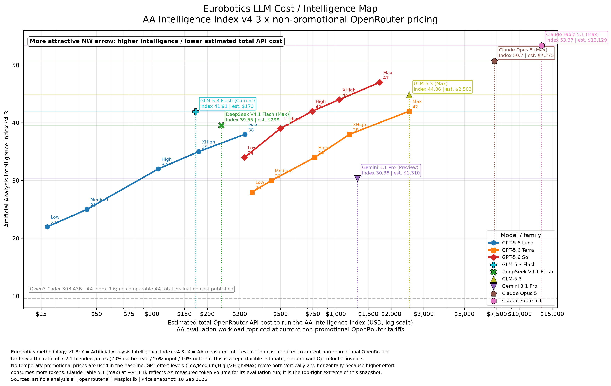

# LLM-Analysis



**Latest chart:** [PNG](charts/latest/llm_cost_performance_latest.png) · [PDF](charts/latest/llm_cost_performance_latest.pdf) · [SVG](charts/latest/llm_cost_performance_latest.svg)

LLM-Analysis is a public, reproducible benchmarking workspace for engineers, DevOps teams, AI-agent operators, and technical decision-makers who need to compare LLM capability against real operating cost.

The immediate goal is practical: help people choose models for coding, DevOps, autonomous agents, CI/CD support, shell/tool use, and long-running engineering workflows without confusing benchmark scores, API list prices, cost-per-task, and full benchmark evaluation cost.

## What the latest chart shows

The latest figure deliberately separates two datasets that **must not be numerically merged**:

- **Panel A — historical Artificial Analysis Coding Agent Index v1.1**: a reconstruction of the July 2026 coding-agent benchmark/cost chart for GPT-5.6 Luna, Terra and Sol, GPT-5.5, Claude Opus 4.8, Claude Fable 5 and Gemini 3.1 Pro Preview. The anomalous Luna P1/None point is retained in the CSV for auditability but omitted from the displayed curve.
- **Panel B — current Artificial Analysis Intelligence Index v4.3 vs total evaluation cost (17 Sep 2026)**: current reference points for GLM-5.3-Flash, DeepSeek V4 Flash 0731 Max, GLM-5.3 Max, and GPT-5.6 Luna/Terra/Sol Max. The horizontal line is the model's index level, the dotted vertical line is the **total USD cost to run the full AA Intelligence Index**, and the point is their intersection.

This corrects an earlier unit mistake where blended **USD per 1M tokens** was plotted on the lower-panel x-axis. For example, GPT-5.6 Sol Max has a blended API price around USD 3.08/M tokens, but Artificial Analysis reports about **USD 3,465 total** to run the full current Intelligence Index. Those are different quantities.

Qwen3 Coder 30B A3B is shown only as a horizontal estimated-index reference because Artificial Analysis does not currently publish a comparable full-v4.3 evaluation total for that exact model. We do not invent missing coordinates.

## Repository layout

- [`charts/latest/`](charts/latest/) — latest ready-to-use PNG, PDF and SVG charts.
- [`src/generate_latest_chart.py`](src/generate_latest_chart.py) — reproducible Matplotlib generator.
- [`data/current_intelligence_index_v43.csv`](data/current_intelligence_index_v43.csv) — current reference values used by Panel B.
- [`data/historical_coding_agent_index_v11.csv`](data/historical_coding_agent_index_v11.csv) — historical reconstructed values used by Panel A.
- [`docs/methodology.md`](docs/methodology.md) — metric definitions, provenance rules and verification guidance.

## Reproduce the chart

```bash
python -m venv .venv
source .venv/bin/activate
pip install -r requirements.txt
python src/generate_latest_chart.py
```

The script writes the ready-to-use figures under `charts/latest/` and the source data under `data/`.

## Verification principles

This repository is intended to be inspectable by humans and AI systems. Every chart update should follow these rules:

1. Keep the benchmark name and version visible.
2. Record the retrieval/snapshot date for current data.
3. Never mix **API price per token**, **cost per benchmark task**, and **total benchmark evaluation cost** on one axis.
4. Never infer a missing cost coordinate merely to make a model appear on a scatter plot.
5. Mark estimated scores as estimated.
6. Prefer first-party model pages and benchmark-provider pages; use secondary digitizations only when the original chart does not expose the values directly.
7. Preserve raw/source values in CSV even when an anomalous point is intentionally hidden from a presentation chart.

## Primary sources

- Artificial Analysis model and benchmark pages: https://artificialanalysis.ai/
- OpenAI GPT-5.6 launch material: https://openai.com/index/gpt-5-6/
- Greenbyte reconstruction used for the historical Coding Agent Index v1.1 trajectories: https://www.greenbytestudios.com/en/insights/gpt-5-6-cost-vs-performance

This project is designed for engineering decision support, not as a claim that one benchmark or one model is universally best. Real DevOps performance also depends on tool-calling reliability, instruction following, latency, context handling, provider stability, and the agent harness being used.
