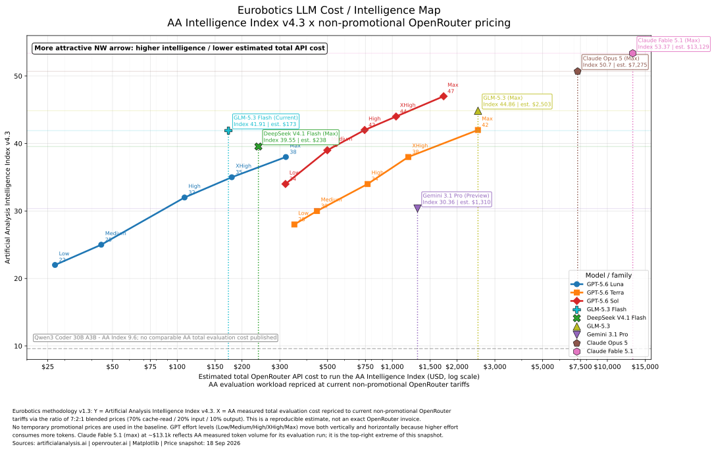

# LLM-Analysis

**Latest chart:** [SVG](charts/latest/llm_cost_performance_latest.svg) · [PNG](charts/latest/llm_cost_performance_latest.png) · [PDF](charts/latest/llm_cost_performance_latest.pdf) · [source data](data/eurobotics_v12_aa_v43_openrouter_total_cost_2026-09-18.csv) · [Matplotlib code](src/generate_latest_chart.py)

LLM-Analysis is a public Eurobotics project for comparing language models used in **DevOps, coding-adjacent agent work, autonomous engineering workflows and AI-assisted software operations**.

## Eurobotics methodology v1.2

The main chart uses:

- **Y-axis — capability:** Artificial Analysis **Intelligence Index v4.3**
- **X-axis — estimated total API cost:** Artificial Analysis measured evaluation workload repriced to **current OpenRouter headline pricing**
- **Rendering:** Python + Matplotlib

The important point is that reasoning effort changes both performance and workload. Low / Medium / High / XHigh / Max therefore move both upward and rightward.

### Repricing rule

> **Estimated OpenRouter total evaluation cost = AA total evaluation cost × (OpenRouter blended tariff / AA reference blended tariff)**

The blended tariff uses:

> **70% cache-read + 20% uncached input + 10% output**

This is a reproducible estimate, not an exact OpenRouter invoice. See [docs/methodology.md](docs/methodology.md) for the limitation and rationale.

## Current pricing policy

The chart uses the **current OpenRouter headline price shown on the model/comparator pages** and marks active promotions with \`*\`.

This means the chart is intentionally a dated market snapshot. At the current snapshot, both GPT-5.6 Sol and GLM-5.3 Flash have promotional pricing, so their current ordering can differ from normal list-price ordering.

## Current model set

- GPT-5.6 Luna — Low / Medium / High / XHigh / Max
- GPT-5.6 Terra — Low / Medium / High / XHigh / Max
- GPT-5.6 Sol — Low / Medium / High / XHigh / Max
- GLM-5.3 Flash
- DeepSeek **V4.1 Flash**
- GLM-5.3 Max
- Qwen3 Coder 30B A3B — intelligence reference only because AA does not publish a comparable total evaluation cost

## Current OpenRouter snapshot

18 September 2026.

Selected current prices used in the repricing:

| Model | Input / 1M | Output / 1M | Cache read / 1M | Note |
|---|---:|---:|---:|---|
| GLM-5.3 Flash | $0.075 | $0.25 | $0.015 | current 50% promotion |
| DeepSeek V4.1 Flash | $0.15 | $0.60 | $0.015 | current |
| GPT-5.6 Luna | $0.20 | $1.20 | $0.02 | current |
| GPT-5.6 Terra | $2.00 | $12.00 | $0.20 | current |
| GPT-5.6 Sol | $2.00 | $10.00 | $0.20 | current 50% promotion |
| GLM-5.3 | $1.00 | $3.41 | $0.20 | current headline |

## Why GLM-5.3 Flash can look dramatically cheaper than Terra

This is not a plotting error. OpenRouter currently shows GLM-5.3 Flash at $0.075/M input and $0.25/M output versus Terra at $2/M and $12/M. That is a very large market-price gap.

The chart preserves Artificial Analysis' measured workload/effort pattern and reprices it to those OpenRouter rates.

## Sources

- Artificial Analysis: https://artificialanalysis.ai/
- OpenRouter: https://openrouter.ai/

## Reproduce

\`\`\`bash
python -m venv .venv
source .venv/bin/activate
pip install -r requirements.txt
python src/generate_latest_chart.py
\`\`\`

## Repository structure

- [\`charts/latest/\`](charts/latest/) — latest ready-to-use chart
- [\`data/\`](data/) — auditable source and derived data
- [\`src/\`](src/) — Matplotlib generator
- [\`docs/\`](docs/) — methodology
- [\`charts/historical/\`](charts/historical/) — historical charts retained for reference

## License

- **Code:** MIT License
- **Charts, documentation and curated data:** CC BY 4.0 (see \`LICENSE-CONTENT.md\`)
