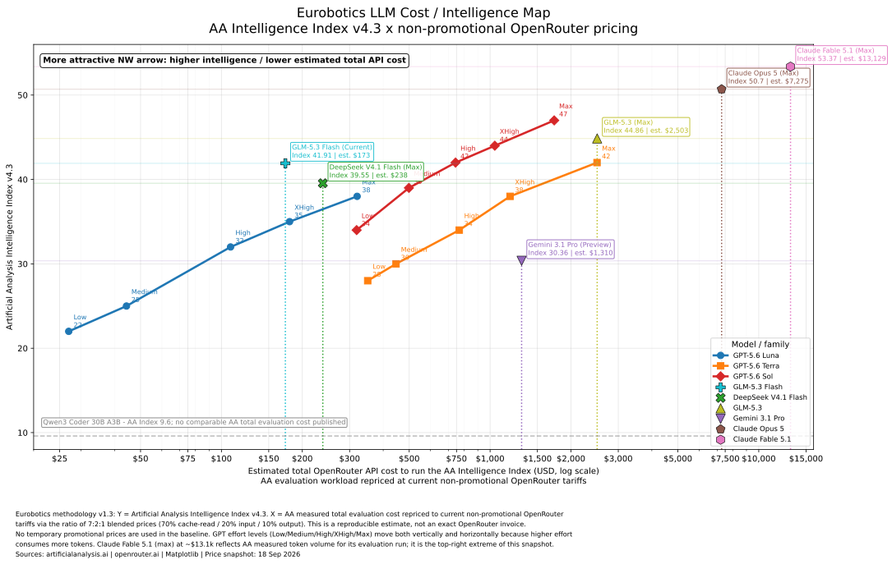

# Eurobotics LLM Cost / Intelligence Map

**Latest chart:** [SVG](charts/latest/llm_cost_performance_latest.svg) · [PNG](charts/latest/llm_cost_performance_latest.png) · [PDF](charts/latest/llm_cost_performance_latest.pdf) · [source data](data/eurobotics_v16_aa_v432_openrouter_nopromo_eurobotics_261002_1705.csv) · [Matplotlib code](src/generate_latest_chart.py)

LLM-Analysis is a public Eurobotics project comparing language models for DevOps, coding agents, autonomous engineering, and AI-assisted operations.

## Methodology v1.6 (2 October 2026)

- **Capability:** Artificial Analysis Intelligence Index v4.3 series. The new GPT-6 points use AA v4.3.2.
- **Cost:** AA's measured total evaluation cost, repriced to non-promotional OpenRouter standard-provider tariffs.
- **Blend:** 70% cache read + 20% uncached input + 10% output. Estimated OpenRouter cost = AA total cost × (OpenRouter blend / AA reference blend).
- **Effort:** GPT-5.6 and GPT-6 variants are plotted as separate effort points, so both intelligence and evaluation cost change along each curve.

GPT-6 Luna now spans **Index 22–38 at about $11–$122**; GPT-6 Sol spans **Index 34–48 at about $269–$1,536**. AA publishes rounded total costs for these points. GPT-6 Astra Max is also included at Index 52.7 and about $5,324. [AA GPT-6 Luna](https://artificialanalysis.ai/models/releases/gpt-6-luna), [AA GPT-6 Sol](https://artificialanalysis.ai/models/releases/gpt-6-sol), [AA Astra comparison](https://artificialanalysis.ai/models/comparisons/gpt-6-sol-low-vs-gpt-6-astra).

The [2 October price audit](docs/methodology.md) checks every charted model against OpenRouter. GPT-5.6 Sol uses its **$4/$20 undiscounted** tariff despite the 50% offer. GLM-5.3 Flash uses Z.ai's current **$0.15/$0.50** list tariff; the old $0.09/$0.30 rate is promotional today. Mistral Small 3.2 is now an intelligence-only reference because AA marks its score as estimated and no longer publishes a comparable current total evaluation cost. Its OpenRouter URL now identifies the actual 3.2 endpoint.

The chart is informational only and must not be used for budgeting. Verify current prices and model capability for your own requirements. Eurobotics.org provides no warranty. [Open an issue](https://github.com/Eurobotics-Association/LLM-Analysis/issues) to request a correction or improvement.

## Reproduce

Run `python src/generate_latest_chart.py` after installing `requirements.txt`. The renderer writes timestamped PNG, PDF, and SVG files in `charts/latest/` and refreshes the stable `latest` aliases linked above.

See [methodology](docs/methodology.md), [data](data/), and [contributor conventions](AGENTS.md).
